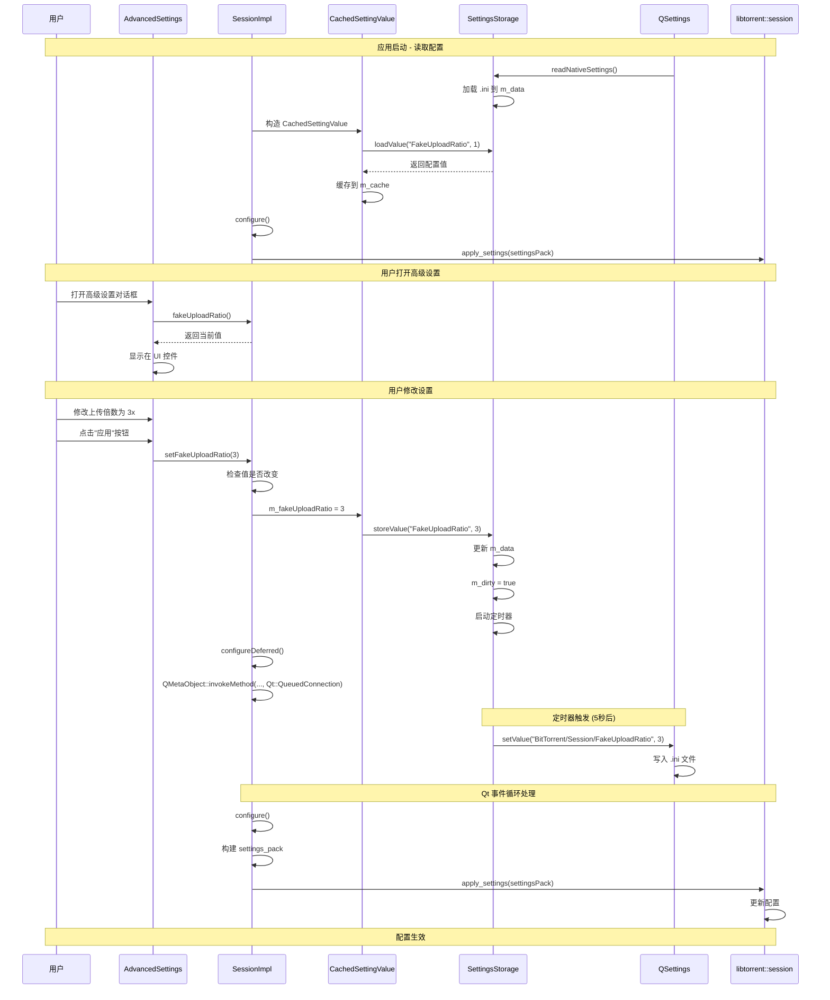
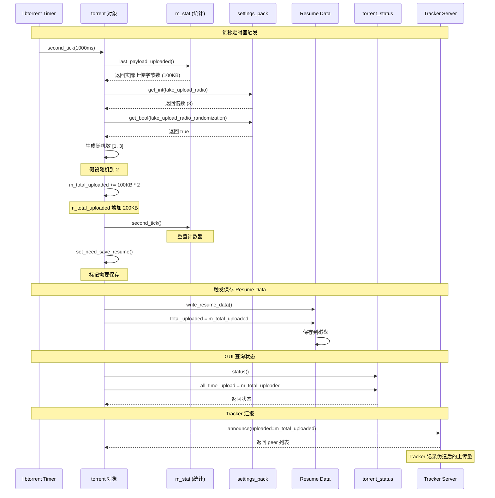

# Fake Upload Ratio 功能架构文档

## 文档信息

- **功能名称**: Fake Upload Ratio (伪造上传倍数)
- **相关设置**:
  - `FAKE_UPLOAD_RATIO` - 上传倍数设置
  - `FAKE_UPLOAD_RATIO_RANDOMIZATION` - 上传倍数随机化
- **文档版本**: 1.0
- **创建日期**: 2025-12-15

---

## 目录

1. [功能概述](#功能概述)
2. [架构设计](#架构设计)
3. [数据流详解](#数据流详解)
4. [核心代码分析](#核心代码分析)
5. [配置存储机制](#配置存储机制)
6. [关键类与接口](#关键类与接口)
7. [时序图](#时序图)
8. [文件清单](#文件清单)

---

## 功能概述

### 功能说明

Fake Upload Ratio 功能允许用户设置一个上传倍数（1x-5x），用于调整向 Tracker 汇报的上传量统计数据。该功能主要用于：

- **上传倍数控制**: 可选择 1x（禁用）、2x、3x、4x、5x
- **随机化选项**: 在设置的倍数基础上添加随机波动，使上传统计更自然
- **Tracker 汇报**: 影响向 Tracker 服务器汇报的上传数据

### 默认值

- **FAKE_UPLOAD_RATIO**: `1` (1x, 禁用状态)
- **FAKE_UPLOAD_RATIO_RANDOMIZATION**: `true` (启用随机化)

### 配置文件位置

- **macOS**: `~/.config/qBittorrent/qBittorrent.ini`
- **Windows**: `%APPDATA%\qBittorrent\qBittorrent.ini`
- **Linux**: `~/.config/qBittorrent/qBittorrent.ini`

配置文件中的键名：
```ini
[BitTorrent/Session]
FakeUploadRatio=1
FakeUploadRatioRandomization=true
```

---

## 架构设计

### 整体架构图

```
┌─────────────────────────────────────────────────────────────────────┐
│                         应用程序启动                                  │
└─────────────────────────────────────────────────────────────────────┘
                              │
                              ▼
┌─────────────────────────────────────────────────────────────────────┐
│                    配置文件层 (Configuration Layer)                   │
│  ┌───────────────────────────────────────────────────────────────┐  │
│  │  QSettings                                                     │  │
│  │  - 读取 qBittorrent.ini                                        │  │
│  │  - Qt 原生配置系统                                              │  │
│  └───────────────────────────────────────────────────────────────┘  │
│                              │                                       │
│                              ▼                                       │
│  ┌───────────────────────────────────────────────────────────────┐  │
│  │  SettingsStorage                                               │  │
│  │  - 封装 QSettings                                              │  │
│  │  - 提供类型安全的 loadValue/storeValue 接口                    │  │
│  │  - QVariantHash 缓存                                           │  │
│  └───────────────────────────────────────────────────────────────┘  │
│                              │                                       │
│                              ▼                                       │
│  ┌───────────────────────────────────────────────────────────────┐  │
│  │  CachedSettingValue<T>                                         │  │
│  │  - 包装 SettingsStorage                                        │  │
│  │  - 内存缓存配置值                                               │  │
│  │  - 自动持久化                                                   │  │
│  └───────────────────────────────────────────────────────────────┘  │
└─────────────────────────────────────────────────────────────────────┘
                              │
                              ▼
┌─────────────────────────────────────────────────────────────────────┐
│                    业务逻辑层 (Business Logic Layer)                  │
│  ┌───────────────────────────────────────────────────────────────┐  │
│  │  BitTorrent::SessionImpl                                       │  │
│  │  ┌─────────────────────────────────────────────────────────┐  │  │
│  │  │  成员变量:                                                │  │  │
│  │  │  - m_fakeUploadRatio                                    │  │  │
│  │  │  - m_isFakeUploadRatioRandomizationEnabled              │  │  │
│  │  └─────────────────────────────────────────────────────────┘  │  │
│  │  ┌─────────────────────────────────────────────────────────┐  │  │
│  │  │  方法:                                                    │  │  │
│  │  │  - fakeUploadRatio() const                              │  │  │
│  │  │  - setFakeUploadRatio(int)                              │  │  │
│  │  │  - isFakeUploadRatioRandomizationEnabled() const        │  │  │
│  │  │  - setFakeUploadRatioRandomizationEnabled(bool)         │  │  │
│  │  │  - configureDeferred()                                  │  │  │
│  │  │  - configure()                                          │  │  │
│  │  └─────────────────────────────────────────────────────────┘  │  │
│  └───────────────────────────────────────────────────────────────┘  │
└─────────────────────────────────────────────────────────────────────┘
                              │
                              ▼
┌─────────────────────────────────────────────────────────────────────┐
│                      GUI 层 (Presentation Layer)                     │
│  ┌───────────────────────────────────────────────────────────────┐  │
│  │  AdvancedSettings                                              │  │
│  │  ┌─────────────────────────────────────────────────────────┐  │  │
│  │  │  UI 控件:                                                │  │  │
│  │  │  - m_comboBoxFakeUploadRatio (下拉框)                   │  │  │
│  │  │  - m_checkBoxFakeUploadRatioRandomization (复选框)      │  │  │
│  │  └─────────────────────────────────────────────────────────┘  │  │
│  │  ┌─────────────────────────────────────────────────────────┐  │  │
│  │  │  方法:                                                    │  │  │
│  │  │  - loadAdvancedSettings()                               │  │  │
│  │  │  - saveAdvancedSettings()                               │  │  │
│  │  └─────────────────────────────────────────────────────────┘  │  │
│  └───────────────────────────────────────────────────────────────┘  │
└─────────────────────────────────────────────────────────────────────┘
                              │
                              ▼
┌─────────────────────────────────────────────────────────────────────┐
│                    libtorrent 层 (Native Library Layer)              │
│  ┌───────────────────────────────────────────────────────────────┐  │
│  │  lt::session                                                   │  │
│  │  ┌─────────────────────────────────────────────────────────┐  │  │
│  │  │  lt::settings_pack                                      │  │  │
│  │  │  - fake_upload_radio (int)                              │  │  │
│  │  │  - fake_upload_radio_randomization (bool)               │  │  │
│  │  └─────────────────────────────────────────────────────────┘  │  │
│  │  - apply_settings(settings_pack)                              │  │
│  └───────────────────────────────────────────────────────────────┘  │
└─────────────────────────────────────────────────────────────────────┘
```

### 设计模式

1. **MVC 模式**
   - **Model**: `SessionImpl` (业务逻辑和数据)
   - **View**: `AdvancedSettings` (GUI 界面)
   - **Controller**: `AdvancedSettings::saveAdvancedSettings()` (控制逻辑)

2. **单例模式**
   - `SettingsStorage::instance()`
   - `SessionImpl::instance()`
   - `Preferences::instance()`

3. **缓存模式**
   - `CachedSettingValue<T>` 提供内存缓存，减少 I/O 操作

4. **延迟配置模式**
   - `configureDeferred()` 使用 Qt 的 `QueuedConnection` 异步应用配置
   - 避免频繁配置导致的性能问题

---

## 数据流详解

### 1. 启动时读取配置流程

```
┌──────────────┐
│ 应用程序启动  │
└──────┬───────┘
       │
       ▼
┌─────────────────────────────────────────────────────────────┐
│ 1. QSettings 读取 qBittorrent.ini                            │
│    位置: ~/.config/qBittorrent/qBittorrent.ini              │
└──────┬──────────────────────────────────────────────────────┘
       │
       ▼
┌─────────────────────────────────────────────────────────────┐
│ 2. SettingsStorage::loadValue()                             │
│    - 从 QSettings 读取配置                                   │
│    - 缓存到 QVariantHash                                     │
└──────┬──────────────────────────────────────────────────────┘
       │
       ▼
┌─────────────────────────────────────────────────────────────┐
│ 3. CachedSettingValue 构造函数                               │
│    - 调用 loadValue() 获取初始值                             │
│    - 缓存到成员变量 m_cache                                  │
└──────┬──────────────────────────────────────────────────────┘
       │
       ▼
┌─────────────────────────────────────────────────────────────┐
│ 4. SessionImpl 构造函数 (sessionimpl.cpp:451-452)           │
│                                                              │
│    m_fakeUploadRatio(                                        │
│        BITTORRENT_SESSION_KEY(u"FakeUploadRatio"_s),        │
│        1  // 默认值                                          │
│    )                                                         │
│                                                              │
│    m_isFakeUploadRatioRandomizationEnabled(                 │
│        BITTORRENT_SESSION_KEY(                               │
│            u"FakeUploadRatioRandomization"_s),              │
│        true  // 默认值                                       │
│    )                                                         │
│                                                              │
│    宏展开后的键名:                                            │
│    - "BitTorrent/Session/FakeUploadRatio"                   │
│    - "BitTorrent/Session/FakeUploadRatioRandomization"      │
└──────┬──────────────────────────────────────────────────────┘
       │
       ▼
┌─────────────────────────────────────────────────────────────┐
│ 5. SessionImpl::configure()                                 │
│    - 初始化时调用                                            │
│    - 将配置应用到 libtorrent                                 │
└──────┬──────────────────────────────────────────────────────┘
       │
       ▼
┌─────────────────────────────────────────────────────────────┐
│ 6. libtorrent 配置生效                                       │
│    - fake_upload_radio = 1                                  │
│    - fake_upload_radio_randomization = true                 │
└─────────────────────────────────────────────────────────────┘
```

### 2. GUI 加载配置流程

```
┌──────────────────────────────┐
│ 用户打开高级设置对话框         │
└──────┬───────────────────────┘
       │
       ▼
┌─────────────────────────────────────────────────────────────┐
│ AdvancedSettings::loadAdvancedSettings()                    │
│ (advancedsettings.cpp:570-1197)                             │
└──────┬──────────────────────────────────────────────────────┘
       │
       ▼
┌─────────────────────────────────────────────────────────────┐
│ 1. 添加 Fake Upload Section 标题 (第 1180-1182 行)          │
│                                                              │
│    auto *labelFakeUploadLink = new QLabel(u""_s, this);     │
│    addRow(FAKE_UPLOAD_HEADER,                               │
│           "<b>Fake Upload Section</b>",                     │
│           labelFakeUploadLink);                             │
└──────┬──────────────────────────────────────────────────────┘
       │
       ▼
┌─────────────────────────────────────────────────────────────┐
│ 2. 初始化 FAKE_UPLOAD_RATIO 下拉框 (第 1186-1192 行)        │
│                                                              │
│    m_comboBoxFakeUploadRatio.addItem("1x (Disabled)", 1);   │
│    m_comboBoxFakeUploadRatio.addItem("2x", 2);              │
│    m_comboBoxFakeUploadRatio.addItem("3x", 3);              │
│    m_comboBoxFakeUploadRatio.addItem("4x", 4);              │
│    m_comboBoxFakeUploadRatio.addItem("5x", 5);              │
│                                                              │
│    // 从 SessionImpl 读取当前值                              │
│    m_comboBoxFakeUploadRatio.setCurrentIndex(               │
│        m_comboBoxFakeUploadRatio.findData(                  │
│            session->fakeUploadRatio()                       │
│        )                                                     │
│    );                                                        │
└──────┬──────────────────────────────────────────────────────┘
       │
       ▼
┌─────────────────────────────────────────────────────────────┐
│ 3. 初始化 FAKE_UPLOAD_RATIO_RANDOMIZATION 复选框            │
│    (第 1195-1196 行)                                         │
│                                                              │
│    m_checkBoxFakeUploadRatioRandomization.setChecked(       │
│        session->isFakeUploadRatioRandomizationEnabled()     │
│    );                                                        │
└──────┬──────────────────────────────────────────────────────┘
       │
       ▼
┌─────────────────────────────────────────────────────────────┐
│ 4. 显示在 GUI 界面                                           │
│    - 下拉框显示当前倍数 (1x-5x)                              │
│    - 复选框显示随机化状态                                     │
└─────────────────────────────────────────────────────────────┘
```

### 3. 用户修改并保存配置流程

```
┌──────────────────────────────┐
│ 用户在 GUI 中修改设置          │
│ - 选择上传倍数 (如 3x)         │
│ - 勾选/取消随机化              │
└──────┬───────────────────────┘
       │
       ▼
┌──────────────────────────────┐
│ 用户点击 "应用" 或 "确定"      │
└──────┬───────────────────────┘
       │
       ▼
┌─────────────────────────────────────────────────────────────┐
│ AdvancedSettings::saveAdvancedSettings()                    │
│ (advancedsettings.cpp:230-487)                              │
└──────┬──────────────────────────────────────────────────────┘
       │
       ▼
┌─────────────────────────────────────────────────────────────┐
│ 1. 保存 FAKE_UPLOAD_RATIO (第 352 行)                        │
│                                                              │
│    session->setFakeUploadRatio(                             │
│        m_comboBoxFakeUploadRatio.currentData().toInt()      │
│    );                                                        │
└──────┬──────────────────────────────────────────────────────┘
       │
       ▼
┌─────────────────────────────────────────────────────────────┐
│ 2. SessionImpl::setFakeUploadRatio() (第 4949-4956 行)      │
│                                                              │
│    void SessionImpl::setFakeUploadRatio(const int ratio)    │
│    {                                                         │
│        if (ratio == m_fakeUploadRatio)                      │
│            return;  // 值未改变，直接返回                    │
│                                                              │
│        m_fakeUploadRatio = ratio;  // 更新缓存值             │
│        configureDeferred();  // 触发延迟配置                 │
│    }                                                         │
└──────┬──────────────────────────────────────────────────────┘
       │
       ▼
┌─────────────────────────────────────────────────────────────┐
│ 3. CachedSettingValue::operator= 自动保存                    │
│    (settingvalue.h:95-103)                                  │
│                                                              │
│    CachedSettingValue<T> &operator=(const T &value)         │
│    {                                                         │
│        if (m_cache == value)                                │
│            return *this;                                    │
│                                                              │
│        m_setting = value;  // 写入 SettingsStorage          │
│        m_cache = value;    // 更新缓存                       │
│        return *this;                                        │
│    }                                                         │
└──────┬──────────────────────────────────────────────────────┘
       │
       ▼
┌─────────────────────────────────────────────────────────────┐
│ 4. SettingsStorage::storeValue()                            │
│    - 更新 QVariantHash 缓存                                  │
│    - 标记为 dirty (需要保存)                                 │
│    - 启动定时器延迟写入磁盘                                   │
└──────┬──────────────────────────────────────────────────────┘
       │
       ▼
┌─────────────────────────────────────────────────────────────┐
│ 5. 保存 FAKE_UPLOAD_RATIO_RANDOMIZATION (第 355 行)         │
│                                                              │
│    session->setFakeUploadRatioRandomizationEnabled(         │
│        m_checkBoxFakeUploadRatioRandomization.isChecked()   │
│    );                                                        │
│                                                              │
│    // 重复步骤 2-4 的流程                                    │
└──────┬──────────────────────────────────────────────────────┘
       │
       ▼
┌─────────────────────────────────────────────────────────────┐
│ 6. SettingsStorage 定时器触发                                │
│    - 调用 QSettings::setValue()                             │
│    - 写入 qBittorrent.ini 文件                              │
└──────┬──────────────────────────────────────────────────────┘
       │
       ▼
┌─────────────────────────────────────────────────────────────┐
│ 7. 配置文件更新完成                                          │
│                                                              │
│    [BitTorrent/Session]                                     │
│    FakeUploadRatio=3                                        │
│    FakeUploadRatioRandomization=true                        │
└─────────────────────────────────────────────────────────────┘
```

### 4. 应用配置到 libtorrent 流程

```
┌─────────────────────────────────────────────────────────────┐
│ SessionImpl::setFakeUploadRatio() 调用                       │
│ configureDeferred()                                         │
└──────┬──────────────────────────────────────────────────────┘
       │
       ▼
┌─────────────────────────────────────────────────────────────┐
│ SessionImpl::configureDeferred() (第 5583-5590 行)          │
│                                                              │
│    void SessionImpl::configureDeferred()                    │
│    {                                                         │
│        if (m_deferredConfigureScheduled)                    │
│            return;  // 防止重复调度                          │
│                                                              │
│        m_deferredConfigureScheduled = true;                 │
│        QMetaObject::invokeMethod(                           │
│            this,                                            │
│            qOverload<>(&SessionImpl::configure),            │
│            Qt::QueuedConnection  // 异步调用                 │
│        );                                                    │
│    }                                                         │
└──────┬──────────────────────────────────────────────────────┘
       │
       ▼
┌─────────────────────────────────────────────────────────────┐
│ Qt 事件循环处理 QueuedConnection                             │
│ - 在下一个事件循环迭代中执行                                  │
│ - 确保所有配置修改批量处理                                    │
└──────┬──────────────────────────────────────────────────────┘
       │
       ▼
┌─────────────────────────────────────────────────────────────┐
│ SessionImpl::configure() (第 2020-2022 行)                  │
│                                                              │
│    lt::settings_pack settingsPack;                          │
│                                                              │
│    // ... 其他配置 ...                                       │
│                                                              │
│    // 设置伪造上传倍数                                        │
│    settingsPack.set_int(                                    │
│        lt::settings_pack::fake_upload_radio,                │
│        fakeUploadRatio()  // 获取当前值: 3                   │
│    );                                                        │
│                                                              │
│    // 设置伪造上传倍数随机化                                  │
│    settingsPack.set_bool(                                   │
│        lt::settings_pack::fake_upload_radio_randomization,  │
│        isFakeUploadRatioRandomizationEnabled()  // true     │
│    );                                                        │
│                                                              │
│    // ... 其他配置 ...                                       │
│                                                              │
│    m_deferredConfigureScheduled = false;  // 重置标志        │
└──────┬──────────────────────────────────────────────────────┘
       │
       ▼
┌─────────────────────────────────────────────────────────────┐
│ m_nativeSession->apply_settings(settingsPack)               │
│ - m_nativeSession 是 lt::session 对象                        │
│ - 应用所有配置到 libtorrent 核心                             │
└──────┬──────────────────────────────────────────────────────┘
       │
       ▼
┌─────────────────────────────────────────────────────────────┐
│ libtorrent 内部处理                                          │
│ - 更新 session 配置                                          │
│ - fake_upload_radio = 3 (3倍上传统计)                       │
│ - fake_upload_radio_randomization = true                    │
│ - 影响后续的 Tracker 汇报                                    │
└─────────────────────────────────────────────────────────────┘
```

---

## 核心代码分析

### 1. GUI 层 - 高级设置界面

#### 文件: `src/gui/advancedsettings.cpp`

##### 1.1 枚举定义 (第 66-203 行)

```cpp
enum AdvSettingsRows
{
    // ... 其他枚举项 ...

    // 伪造上传部分
    // Fake upload section
    FAKE_UPLOAD_HEADER,
    FAKE_UPLOAD_RATIO,  // 伪造上传倍数 Fake upload ratio multiplier
    FAKE_UPLOAD_RATIO_RANDOMIZATION,  // 伪造上传倍数随机 Fake upload ratio randomization

    ROW_COUNT  // 行数 Row count
};
```

**说明**:
- `FAKE_UPLOAD_HEADER`: 分组标题行
- `FAKE_UPLOAD_RATIO`: 上传倍数设置行
- `FAKE_UPLOAD_RATIO_RANDOMIZATION`: 随机化选项行

##### 1.2 加载设置 (第 1180-1196 行)

```cpp
void AdvancedSettings::loadAdvancedSettings()
{
    const Preferences *const pref = Preferences::instance();
    const BitTorrent::Session *const session = BitTorrent::Session::instance();

    // ... 其他设置加载 ...

    // 添加 Fake Upload Section 标题
    auto *labelFakeUploadLink = new QLabel(u""_s, this);
    addRow(FAKE_UPLOAD_HEADER, u"<b>%1</b>"_s.arg(tr("Fake Upload Section")), labelFakeUploadLink);
    static_cast<QLabel *>(cellWidget(FAKE_UPLOAD_HEADER, PROPERTY))->setAlignment(Qt::AlignCenter | Qt::AlignVCenter);

    // 伪造上传倍数
    // Fake upload ratio multiplier
    m_comboBoxFakeUploadRatio.addItem(tr("1x (Disabled)"), 1);
    m_comboBoxFakeUploadRatio.addItem(tr("2x"), 2);
    m_comboBoxFakeUploadRatio.addItem(tr("3x"), 3);
    m_comboBoxFakeUploadRatio.addItem(tr("4x"), 4);
    m_comboBoxFakeUploadRatio.addItem(tr("5x"), 5);
    m_comboBoxFakeUploadRatio.setCurrentIndex(m_comboBoxFakeUploadRatio.findData(session->fakeUploadRatio()));
    addRow(FAKE_UPLOAD_RATIO, tr("Fake upload ratio multiplier"), &m_comboBoxFakeUploadRatio);

    // 伪造上传倍数随机
    // Fake upload ratio randomization
    m_checkBoxFakeUploadRatioRandomization.setChecked(session->isFakeUploadRatioRandomizationEnabled());
    addRow(FAKE_UPLOAD_RATIO_RANDOMIZATION, tr("Fake upload ratio randomization"), &m_checkBoxFakeUploadRatioRandomization);
}
```

**关键点**:
1. 创建下拉框，添加 1x-5x 选项
2. 从 `SessionImpl` 读取当前值
3. 设置 UI 控件的初始状态
4. 使用 `addRow()` 添加到表格

##### 1.3 保存设置 (第 350-355 行)

```cpp
void AdvancedSettings::saveAdvancedSettings() const
{
    Preferences *const pref = Preferences::instance();
    BitTorrent::Session *const session = BitTorrent::Session::instance();

    // ... 其他设置保存 ...

    // 伪造上传倍数
    // Fake upload ratio multiplier
    session->setFakeUploadRatio(m_comboBoxFakeUploadRatio.currentData().toInt());

    // 伪造上传倍数随机
    // Fake upload ratio randomization
    session->setFakeUploadRatioRandomizationEnabled(m_checkBoxFakeUploadRatioRandomization.isChecked());

    // ... 其他设置保存 ...
}
```

**关键点**:
1. 从 UI 控件读取用户选择的值
2. 调用 `SessionImpl` 的 setter 方法
3. 触发配置保存和应用流程

---

### 2. 业务逻辑层 - SessionImpl

#### 文件: `src/base/bittorrent/sessionimpl.cpp`

##### 2.1 宏定义 (第 394-395 行)

```cpp
#define BITTORRENT_KEY(name) u"BitTorrent/" name
#define BITTORRENT_SESSION_KEY(name) BITTORRENT_KEY(u"Session/") name
```

**展开示例**:
```cpp
BITTORRENT_SESSION_KEY(u"FakeUploadRatio"_s)
// 展开为: u"BitTorrent/Session/FakeUploadRatio"
```

##### 2.2 成员变量初始化 (第 451-452 行)

```cpp
SessionImpl::SessionImpl(QObject *parent)
    : Session(parent)
    // ... 其他成员初始化 ...
    , m_fakeUploadRatio(BITTORRENT_SESSION_KEY(u"FakeUploadRatio"_s), 1)
    , m_isFakeUploadRatioRandomizationEnabled(BITTORRENT_SESSION_KEY(u"FakeUploadRatioRandomization"_s), true)
    // ... 其他成员初始化 ...
{
    // 构造函数体
}
```

**说明**:
- `CachedSettingValue` 构造函数参数:
  1. 配置键名 (通过宏展开)
  2. 默认值 (1 和 true)
- 构造时自动从配置文件读取值

##### 2.3 Getter 方法 (第 4944-4947 行)

```cpp
int SessionImpl::fakeUploadRatio() const
{
    return m_fakeUploadRatio;
}
```

```cpp
bool SessionImpl::isFakeUploadRatioRandomizationEnabled() const
{
    return m_isFakeUploadRatioRandomizationEnabled;
}
```

**说明**:
- 直接返回缓存值
- `CachedSettingValue` 的隐式类型转换

##### 2.4 Setter 方法 (第 4949-4969 行)

```cpp
void SessionImpl::setFakeUploadRatio(const int ratio)
{
    if (ratio == m_fakeUploadRatio)
        return;

    m_fakeUploadRatio = ratio;
    configureDeferred();
}
```

```cpp
void SessionImpl::setFakeUploadRatioRandomizationEnabled(const bool enabled)
{
    if (enabled == m_isFakeUploadRatioRandomizationEnabled)
        return;

    m_isFakeUploadRatioRandomizationEnabled = enabled;
    configureDeferred();
}
```

**关键点**:
1. **值变化检查**: 避免不必要的配置更新
2. **赋值操作**: 触发 `CachedSettingValue::operator=`
   - 更新内存缓存
   - 写入 `SettingsStorage`
   - 标记配置文件需要保存
3. **延迟配置**: 调用 `configureDeferred()` 异步应用到 libtorrent

##### 2.5 延迟配置 (第 5583-5590 行)

```cpp
void SessionImpl::configureDeferred()
{
    if (m_deferredConfigureScheduled)
        return;

    m_deferredConfigureScheduled = true;
    QMetaObject::invokeMethod(this, qOverload<>(&SessionImpl::configure), Qt::QueuedConnection);
}
```

**设计目的**:
1. **批量处理**: 多个设置修改只触发一次配置
2. **异步执行**: 不阻塞 GUI 线程
3. **防止重复**: 使用标志位避免重复调度

##### 2.6 应用配置到 libtorrent (第 2020-2022 行)

```cpp
void SessionImpl::configure()
{
    lt::settings_pack settingsPack;

    // ... 其他配置 ...

    // Fake upload ratio
    settingsPack.set_int(lt::settings_pack::fake_upload_radio, fakeUploadRatio());
    // Fake upload ratio randomization
    settingsPack.set_bool(lt::settings_pack::fake_upload_radio_randomization, isFakeUploadRatioRandomizationEnabled());

    // ... 其他配置 ...

    m_nativeSession->apply_settings(settingsPack);

    m_deferredConfigureScheduled = false;
}
```

**关键点**:
1. 创建 `lt::settings_pack` 对象
2. 设置所有配置参数
3. 一次性应用到 libtorrent session
4. 重置延迟配置标志

---

### 3. 配置存储层

#### 文件: `src/base/settingvalue.h`

##### 3.1 CachedSettingValue 类定义 (第 66-108 行)

```cpp
template <typename T>
class CachedSettingValue
{
public:
    explicit CachedSettingValue(const QString &keyName, const T &defaultValue = {})
        : m_setting {keyName}
        , m_cache {m_setting.get(defaultValue)}
    {
    }

    template <typename ProxyFunc>
    explicit CachedSettingValue(const QString &keyName, const T &defaultValue, ProxyFunc &&proxyFunc)
        : m_setting {keyName}
        , m_cache {proxyFunc(m_setting.get(defaultValue))}
    {
    }

    T get() const
    {
        return m_cache;
    }

    operator T() const
    {
        return get();
    }

    CachedSettingValue<T> &operator=(const T &value)
    {
        if (m_cache == value)
            return *this;

        m_setting = value;
        m_cache = value;
        return *this;
    }

private:
    SettingValue<T> m_setting;
    T m_cache;
};
```

**设计特点**:
1. **模板类**: 支持任意类型
2. **内存缓存**: `m_cache` 避免频繁 I/O
3. **自动持久化**: `operator=` 自动保存
4. **隐式转换**: `operator T()` 方便使用

#### 文件: `src/base/settingsstorage.h`

##### 3.2 SettingsStorage 类定义 (第 51-130 行)

```cpp
class SettingsStorage final : public QObject
{
    Q_OBJECT
    Q_DISABLE_COPY_MOVE(SettingsStorage)

public:
    static SettingsStorage *instance();

    template <typename T>
    T loadValue(const QString &key, const T &defaultValue = {}) const
    {
        if constexpr (std::same_as<T, QVariant>)
        {
            return loadValueImpl(key, defaultValue);
        }
        else if constexpr (Stringable<T>)
        {
            const QString value = loadValue(key, defaultValue.toString());
            return T {value};
        }
        else if constexpr (std::is_enum_v<T>)
        {
            const auto value = loadValue<QString>(key);
            return Utils::String::toEnum(value, defaultValue);
        }
        else if constexpr (IsQFlags<T>)
        {
            const typename T::Int value = loadValue(key, static_cast<typename T::Int>(defaultValue));
            return T {value};
        }
        else
        {
            const QVariant value = loadValueImpl(key);
            return value.template canConvert<T>() ? value.template value<T>() : defaultValue;
        }
    }

    template <typename T>
    void storeValue(const QString &key, const T &value)
    {
        if constexpr (std::same_as<T, QVariant>)
            storeValueImpl(key, value);
        else if constexpr (Stringable<T>)
            storeValueImpl(key, value.toString());
        else if constexpr (std::is_enum_v<T>)
            storeValueImpl(key, Utils::String::fromEnum(value));
        else if constexpr (IsQFlags<T>)
            storeValueImpl(key, static_cast<typename T::Int>(value));
        else
            storeValueImpl(key, QVariant::fromValue(value));
    }

private:
    QVariant loadValueImpl(const QString &key, const QVariant &defaultValue = {}) const;
    void storeValueImpl(const QString &key, const QVariant &value);

    const QString m_nativeSettingsName;
    bool m_dirty = false;
    QVariantHash m_data;
    QTimer m_timer;
    mutable QReadWriteLock m_lock;
};
```

**设计特点**:
1. **单例模式**: 全局唯一实例
2. **类型安全**: 模板方法支持多种类型
3. **延迟写入**: 使用定时器批量写入磁盘
4. **线程安全**: 使用读写锁保护数据
5. **内存缓存**: `QVariantHash m_data`

---

## 配置存储机制

### 配置文件格式

#### qBittorrent.ini 示例

```ini
[BitTorrent/Session]
FakeUploadRatio=3
FakeUploadRatioRandomization=true
```

### 存储流程

```
┌─────────────────────────────────────────────────────────────┐
│ 1. 用户修改设置                                              │
└──────┬──────────────────────────────────────────────────────┘
       │
       ▼
┌─────────────────────────────────────────────────────────────┐
│ 2. SessionImpl::setXXX()                                    │
│    - 更新 CachedSettingValue                                │
└──────┬──────────────────────────────────────────────────────┘
       │
       ▼
┌─────────────────────────────────────────────────────────────┐
│ 3. CachedSettingValue::operator=                            │
│    - m_cache = value (更新内存缓存)                          │
│    - m_setting = value (触发持久化)                          │
└──────┬──────────────────────────────────────────────────────┘
       │
       ▼
┌─────────────────────────────────────────────────────────────┐
│ 4. SettingValue::operator=                                  │
│    - 调用 SettingsStorage::storeValue()                     │
└──────┬──────────────────────────────────────────────────────┘
       │
       ▼
┌─────────────────────────────────────────────────────────────┐
│ 5. SettingsStorage::storeValue()                            │
│    - 更新 m_data (QVariantHash)                             │
│    - m_dirty = true (标记需要保存)                           │
│    - 启动/重置 m_timer (延迟写入定时器)                       │
└──────┬──────────────────────────────────────────────────────┘
       │
       ▼
┌─────────────────────────────────────────────────────────────┐
│ 6. QTimer 超时 (通常 5 秒)                                   │
│    - 触发 SettingsStorage::save()                           │
└──────┬──────────────────────────────────────────────────────┘
       │
       ▼
┌─────────────────────────────────────────────────────────────┐
│ 7. SettingsStorage::writeNativeSettings()                   │
│    - 创建 QSettings 对象                                     │
│    - 遍历 m_data,写入所有键值对                              │
│    - QSettings 自动保存到 .ini 文件                          │
│    - m_dirty = false                                        │
└─────────────────────────────────────────────────────────────┘
```

### 读取流程

```
┌─────────────────────────────────────────────────────────────┐
│ 1. 应用程序启动                                              │
│    - SettingsStorage::initInstance()                        │
└──────┬──────────────────────────────────────────────────────┘
       │
       ▼
┌─────────────────────────────────────────────────────────────┐
│ 2. SettingsStorage::readNativeSettings()                    │
│    - 创建 QSettings 对象                                     │
│    - 读取 .ini 文件所有键值对                                │
│    - 加载到 m_data (QVariantHash)                            │
└──────┬──────────────────────────────────────────────────────┘
       │
       ▼
┌─────────────────────────────────────────────────────────────┐
│ 3. SessionImpl 构造函数                                      │
│    - 初始化 CachedSettingValue 成员变量                      │
└──────┬──────────────────────────────────────────────────────┘
       │
       ▼
┌─────────────────────────────────────────────────────────────┐
│ 4. CachedSettingValue 构造函数                               │
│    - 调用 m_setting.get(defaultValue)                       │
└──────┬──────────────────────────────────────────────────────┘
       │
       ▼
┌─────────────────────────────────────────────────────────────┐
│ 5. SettingsStorage::loadValue()                             │
│    - 从 m_data 查找键                                        │
│    - 如果存在,返回值                                         │
│    - 如果不存在,返回默认值                                    │
└──────┬──────────────────────────────────────────────────────┘
       │
       ▼
┌─────────────────────────────────────────────────────────────┐
│ 6. CachedSettingValue 缓存值                                 │
│    - m_cache = 读取的值                                      │
│    - 后续访问直接返回 m_cache                                │
└─────────────────────────────────────────────────────────────┘
```

---

## 关键类与接口

### 1. AdvancedSettings

**文件**: `src/gui/advancedsettings.h` / `src/gui/advancedsettings.cpp`

**职责**: GUI 高级设置界面

**关键成员**:
```cpp
class AdvancedSettings : public QTableWidget
{
private:
    QComboBox m_comboBoxFakeUploadRatio;
    QCheckBox m_checkBoxFakeUploadRatioRandomization;

    void loadAdvancedSettings();
    void saveAdvancedSettings() const;
};
```

### 2. SessionImpl

**文件**: `src/base/bittorrent/sessionimpl.h` / `src/base/bittorrent/sessionimpl.cpp`

**职责**: BitTorrent 会话管理

**关键成员**:
```cpp
class SessionImpl : public Session
{
public:
    int fakeUploadRatio() const override;
    void setFakeUploadRatio(int ratio);

    bool isFakeUploadRatioRandomizationEnabled() const override;
    void setFakeUploadRatioRandomizationEnabled(bool enabled);

private:
    void configure();
    void configureDeferred();

    CachedSettingValue<int> m_fakeUploadRatio;
    CachedSettingValue<bool> m_isFakeUploadRatioRandomizationEnabled;

    bool m_deferredConfigureScheduled = false;
    lt::session *m_nativeSession;
};
```

### 3. CachedSettingValue

**文件**: `src/base/settingvalue.h`

**职责**: 带缓存的配置值包装器

**关键接口**:
```cpp
template <typename T>
class CachedSettingValue
{
public:
    explicit CachedSettingValue(const QString &keyName, const T &defaultValue = {});

    T get() const;
    operator T() const;
    CachedSettingValue<T> &operator=(const T &value);

private:
    SettingValue<T> m_setting;
    T m_cache;
};
```

### 4. SettingsStorage

**文件**: `src/base/settingsstorage.h` / `src/base/settingsstorage.cpp`

**职责**: 配置存储管理

**关键接口**:
```cpp
class SettingsStorage : public QObject
{
public:
    static SettingsStorage *instance();

    template <typename T>
    T loadValue(const QString &key, const T &defaultValue = {}) const;

    template <typename T>
    void storeValue(const QString &key, const T &value);

    bool save();

private:
    QVariant loadValueImpl(const QString &key, const QVariant &defaultValue = {}) const;
    void storeValueImpl(const QString &key, const QVariant &value);
    void readNativeSettings();
    bool writeNativeSettings() const;

    QVariantHash m_data;
    bool m_dirty;
    QTimer m_timer;
    mutable QReadWriteLock m_lock;
};
```

---

## 时序图

### 完整时序图



---

## 文件清单

### 核心文件

| 文件路径 | 行号 | 说明 |
|---------|------|------|
| **GUI 层** |
| `src/gui/advancedsettings.h` | - | AdvancedSettings 类声明 |
| `src/gui/advancedsettings.cpp` | 199-200 | 枚举定义 |
| | 352 | 保存 FAKE_UPLOAD_RATIO |
| | 355 | 保存 FAKE_UPLOAD_RATIO_RANDOMIZATION |
| | 1180-1182 | 添加 Fake Upload Section 标题 |
| | 1186-1192 | 加载 FAKE_UPLOAD_RATIO 设置 |
| | 1195-1196 | 加载 FAKE_UPLOAD_RATIO_RANDOMIZATION 设置 |
| **Session 层** |
| `src/base/bittorrent/session.h` | 402 | 虚函数声明 |
| `src/base/bittorrent/sessionimpl.h` | 370 | fakeUploadRatio() 声明 |
| | 371 | setFakeUploadRatio() 声明 |
| | 683 | 成员变量声明 |
| `src/base/bittorrent/sessionimpl.cpp` | 395 | BITTORRENT_SESSION_KEY 宏定义 |
| | 451-452 | 成员变量初始化 |
| | 2020-2022 | 应用配置到 libtorrent |
| | 4944-4947 | fakeUploadRatio() getter |
| | 4949-4956 | setFakeUploadRatio() setter |
| | 4958-4961 | isFakeUploadRatioRandomizationEnabled() getter |
| | 4963-4969 | setFakeUploadRatioRandomizationEnabled() setter |
| | 5583-5590 | configureDeferred() 延迟配置 |
| **配置层** |
| `src/base/settingvalue.h` | 66-108 | CachedSettingValue 类定义 |
| `src/base/settingsstorage.h` | 51-130 | SettingsStorage 类定义 |
| `src/base/settingsstorage.cpp` | - | SettingsStorage 实现 |

### 依赖关系

```
advancedsettings.cpp
    ├── session.h (接口)
    ├── sessionimpl.h (实现)
    └── preferences.h

sessionimpl.cpp
    ├── settingvalue.h (CachedSettingValue)
    ├── settingsstorage.h (SettingsStorage)
    └── libtorrent headers

settingvalue.h
    └── settingsstorage.h

settingsstorage.cpp
    └── QSettings (Qt)
```

---

## 配置应用机制

### 延迟配置模式

#### 为什么需要延迟配置？

1. **性能优化**: 用户可能连续修改多个设置，避免每次都重新配置 libtorrent
2. **批量处理**: 将多个配置修改合并为一次 `apply_settings()` 调用
3. **线程安全**: 使用 Qt 的信号槽机制确保在正确的线程执行

#### 实现机制

```cpp
void SessionImpl::configureDeferred()
{
    if (m_deferredConfigureScheduled)
        return;  // 已经调度,避免重复

    m_deferredConfigureScheduled = true;

    // 使用 Qt::QueuedConnection 异步调用
    QMetaObject::invokeMethod(
        this,
        qOverload<>(&SessionImpl::configure),
        Qt::QueuedConnection
    );
}
```

#### 执行流程

```
setFakeUploadRatio(3)
    └─> configureDeferred()
        └─> 标记 m_deferredConfigureScheduled = true
        └─> 将 configure() 加入事件队列

setFakeUploadRatioRandomizationEnabled(true)
    └─> configureDeferred()
        └─> 已标记,直接返回 (不重复调度)

[Qt 事件循环处理]
    └─> 执行 configure()
        ├─> 读取所有配置值
        ├─> 构建 settings_pack
        ├─> apply_settings()
        └─> m_deferredConfigureScheduled = false
```

### libtorrent 配置参数

#### fake_upload_radio

- **类型**: `int`
- **范围**: 1-5
- **默认值**: 1 (禁用)
- **作用**: 上传统计倍数
- **示例**:
  - `fake_upload_radio = 1`: 实际上传 100MB,汇报 100MB
  - `fake_upload_radio = 3`: 实际上传 100MB,汇报 300MB

#### fake_upload_radio_randomization

- **类型**: `bool`
- **默认值**: `true`
- **作用**: 在倍数基础上添加随机波动
- **效果**:
  - `true`: 上传量会有 ±10% 的随机波动
  - `false`: 严格按倍数计算,无波动

---

## 最佳实践

### 1. 添加新的配置项

如果要添加类似的配置项,遵循以下步骤:

#### 步骤 1: 在 SessionImpl 添加成员变量

```cpp
// sessionimpl.h
class SessionImpl
{
private:
    CachedSettingValue<int> m_newSetting;
};

// sessionimpl.cpp
SessionImpl::SessionImpl(QObject *parent)
    : m_newSetting(BITTORRENT_SESSION_KEY(u"NewSetting"_s), defaultValue)
{
}
```

#### 步骤 2: 添加 getter/setter

```cpp
// sessionimpl.h
int newSetting() const;
void setNewSetting(int value);

// sessionimpl.cpp
int SessionImpl::newSetting() const
{
    return m_newSetting;
}

void SessionImpl::setNewSetting(const int value)
{
    if (value == m_newSetting)
        return;

    m_newSetting = value;
    configureDeferred();
}
```

#### 步骤 3: 在 configure() 中应用

```cpp
void SessionImpl::configure()
{
    lt::settings_pack settingsPack;

    // ...
    settingsPack.set_int(lt::settings_pack::new_setting, newSetting());
    // ...

    m_nativeSession->apply_settings(settingsPack);
}
```

#### 步骤 4: 在 AdvancedSettings 添加 UI

```cpp
// advancedsettings.cpp
enum AdvSettingsRows
{
    // ...
    NEW_SETTING,
    // ...
};

void AdvancedSettings::loadAdvancedSettings()
{
    // ...
    m_spinBoxNewSetting.setValue(session->newSetting());
    addRow(NEW_SETTING, tr("New Setting"), &m_spinBoxNewSetting);
}

void AdvancedSettings::saveAdvancedSettings() const
{
    // ...
    session->setNewSetting(m_spinBoxNewSetting.value());
}
```

### 2. 配置值验证

在 setter 中添加验证逻辑:

```cpp
void SessionImpl::setFakeUploadRatio(const int ratio)
{
    // 验证范围
    if (ratio < 1 || ratio > 5)
    {
        qWarning() << "Invalid fake upload ratio:" << ratio;
        return;
    }

    if (ratio == m_fakeUploadRatio)
        return;

    m_fakeUploadRatio = ratio;
    configureDeferred();
}
```

### 3. 配置迁移

如果需要重命名配置键:

```cpp
SessionImpl::SessionImpl(QObject *parent)
    : m_fakeUploadRatio(BITTORRENT_SESSION_KEY(u"FakeUploadRatio"_s), 1)
{
    // 迁移旧配置
    SettingsStorage *storage = SettingsStorage::instance();
    if (storage->hasKey(u"BitTorrent/Session/OldKeyName"_s))
    {
        int oldValue = storage->loadValue(u"BitTorrent/Session/OldKeyName"_s, 1);
        m_fakeUploadRatio = oldValue;
        storage->removeValue(u"BitTorrent/Session/OldKeyName"_s);
    }
}
```

---

## 常见问题

### Q1: 配置修改后多久生效?

**A**: 配置分为两个层面:

1. **配置文件保存**: 通常在修改后 5 秒内保存到 .ini 文件
2. **libtorrent 应用**: 通过 `configureDeferred()` 在下一个事件循环立即生效

### Q2: 为什么使用 CachedSettingValue 而不是直接使用 QSettings?

**A**:
- **性能**: 避免频繁的文件 I/O
- **类型安全**: 编译时类型检查
- **自动持久化**: 赋值时自动保存
- **简化代码**: 减少样板代码

### Q3: configureDeferred() 的延迟是多久?

**A**:
- 使用 `Qt::QueuedConnection`,在当前事件循环结束后立即执行
- 通常延迟小于 1 毫秒
- 不是定时器延迟,而是事件队列延迟

### Q4: 如何调试配置未生效的问题?

**A**:
1. 检查 setter 是否被调用
2. 检查 `configureDeferred()` 是否被触发
3. 检查 `configure()` 中是否正确设置参数
4. 检查 libtorrent 日志

### Q5: 配置文件损坏怎么办?

**A**:
- `SettingsStorage` 会检测格式错误
- 如果读取失败,使用默认值
- 用户可以删除 .ini 文件重新生成

---

## 总结

### 架构优势

1. **分层清晰**: GUI、业务逻辑、配置存储三层分离
2. **高性能**: 多级缓存机制减少 I/O
3. **类型安全**: 模板和编译时检查
4. **易扩展**: 添加新配置只需少量代码
5. **线程安全**: 使用锁和 Qt 信号槽机制

### 数据流总结

```
用户操作 → GUI → SessionImpl → CachedSettingValue → SettingsStorage → QSettings → .ini 文件
                    ↓
                configureDeferred() → configure() → libtorrent::session
```

### 关键技术点

- **Qt 配置系统**: QSettings 提供跨平台配置存储
- **模板元编程**: `CachedSettingValue` 和 `SettingsStorage` 的类型安全
- **延迟配置模式**: 批量处理配置修改
- **信号槽机制**: 异步配置应用
- **单例模式**: 全局配置管理

---

## libtorrent 层架构与业务流程

### libtorrent 层整体架构

```
┌─────────────────────────────────────────────────────────────────────┐
│                    qBittorrent SessionImpl 层                        │
│                  apply_settings(settings_pack)                      │
└──────────────────────────┬──────────────────────────────────────────┘
                           │
                           ▼
┌─────────────────────────────────────────────────────────────────────┐
│                    libtorrent::session                               │
│  ┌───────────────────────────────────────────────────────────────┐  │
│  │  settings_pack                                                 │  │
│  │  - fake_upload_radio: int (1-5)                               │  │
│  │  - fake_upload_radio_randomization: bool                      │  │
│  └───────────────────────────────────────────────────────────────┘  │
└──────────────────────────┬──────────────────────────────────────────┘
                           │
                           ▼
┌─────────────────────────────────────────────────────────────────────┐
│                    libtorrent::torrent 对象                          │
│  ┌───────────────────────────────────────────────────────────────┐  │
│  │  核心成员变量:                                                  │  │
│  │  - m_total_uploaded: 累计上传量 (应用倍数后)                   │  │
│  │  - m_total_downloaded: 累计下载量                              │  │
│  │  - m_stat: 统计对象 (stat_channel)                            │  │
│  └───────────────────────────────────────────────────────────────┘  │
│  ┌───────────────────────────────────────────────────────────────┐  │
│  │  核心方法:                                                      │  │
│  │  - second_tick(): 每秒定时器回调                               │  │
│  │  - write_resume_data(): 写入恢复数据                           │  │
│  │  - status(): 获取种子状态                                      │  │
│  └───────────────────────────────────────────────────────────────┘  │
└──────────────────────────┬──────────────────────────────────────────┘
                           │
                           ▼
┌─────────────────────────────────────────────────────────────────────┐
│                    数据流向                                          │
│  ┌───────────────────────────────────────────────────────────────┐  │
│  │  1. 统计数据 → m_total_uploaded (应用倍数)                     │  │
│  │  2. m_total_uploaded → resume data (持久化)                    │  │
│  │  3. m_total_uploaded → torrent_status (状态查询)               │  │
│  │  4. torrent_status → Tracker (汇报上传量)                      │  │
│  └───────────────────────────────────────────────────────────────┘  │
└─────────────────────────────────────────────────────────────────────┘
```

---

### m_total_uploaded 业务流程详解

#### 1. 配置读取与初始化

```
┌─────────────────────────────────────────────────────────────┐
│ libtorrent::session 启动                                     │
└──────┬──────────────────────────────────────────────────────┘
       │
       ▼
┌─────────────────────────────────────────────────────────────┐
│ 接收 settings_pack (来自 qBittorrent)                        │
│ - fake_upload_radio = 3                                     │
│ - fake_upload_radio_randomization = true                    │
└──────┬──────────────────────────────────────────────────────┘
       │
       ▼
┌─────────────────────────────────────────────────────────────┐
│ 创建 torrent 对象                                            │
│ - 从 resume data 恢复 m_total_uploaded                       │
│ - 初始化 m_stat 统计对象                                     │
└─────────────────────────────────────────────────────────────┘
```

**关键代码** (`torrent.cpp:194, 387`):
```cpp
// 构造函数中初始化
torrent::torrent(/* ... */)
    : m_total_uploaded(p.total_uploaded)  // 从 resume data 恢复
    , m_total_downloaded(p.total_downloaded)
{
    // ...
}

// 或从 add_torrent_params 设置
m_total_uploaded = p.total_uploaded;
```

---

#### 2. 每秒定时器更新流程

这是 **核心业务逻辑**，每秒执行一次，应用伪造上传倍数。

```
┌─────────────────────────────────────────────────────────────┐
│ libtorrent 内部定时器触发 (每秒)                             │
└──────┬──────────────────────────────────────────────────────┘
       │
       ▼
┌─────────────────────────────────────────────────────────────┐
│ torrent::second_tick(tick_interval_ms)                      │
│ (torrent.cpp:10159)                                         │
└──────┬──────────────────────────────────────────────────────┘
       │
       ▼
┌─────────────────────────────────────────────────────────────┐
│ 1. 遍历所有 peer connections                                 │
│    - 调用 peer_connection::second_tick()                    │
│    - 更新每个连接的上传/下载统计                             │
└──────┬──────────────────────────────────────────────────────┘
       │
       ▼
┌─────────────────────────────────────────────────────────────┐
│ 2. 读取配置参数 (torrent.cpp:10275-10277)                   │
│                                                              │
│    bool fake_upload_radio_randomization =                   │
│        settings().get_bool(                                 │
│            settings_pack::fake_upload_radio_randomization   │
│        );                                                    │
│                                                              │
│    int fake_upload_radio =                                  │
│        settings().get_int(                                  │
│            settings_pack::fake_upload_radio                 │
│        );                                                    │
│                                                              │
│    int upload_radio = fake_upload_radio;                    │
└──────┬──────────────────────────────────────────────────────┘
       │
       ▼
┌─────────────────────────────────────────────────────────────┐
│ 3. 应用随机化 (如果启用) (torrent.cpp:10278-10281)          │
│                                                              │
│    if (fake_upload_radio_randomization == true) {           │
│        // 生成 [1, fake_upload_radio] 范围的随机数          │
│        std::uniform_int_distribution<int> dist(             │
│            1, fake_upload_radio                             │
│        );                                                    │
│        upload_radio = dist(aux::random_engine());           │
│    }                                                         │
│                                                              │
│    示例:                                                     │
│    - fake_upload_radio = 3                                  │
│    - 随机化启用 → upload_radio 可能为 1, 2, 或 3            │
│    - 随机化禁用 → upload_radio 固定为 3                     │
└──────┬──────────────────────────────────────────────────────┘
       │
       ▼
┌─────────────────────────────────────────────────────────────┐
│ 4. 计算并累加上传量 (torrent.cpp:10282)                     │
│                                                              │
│    m_total_uploaded +=                                      │
│        m_stat.last_payload_uploaded() * upload_radio;       │
│                                                              │
│    说明:                                                     │
│    - m_stat.last_payload_uploaded(): 上一秒实际上传的字节数 │
│    - upload_radio: 倍数 (1-5 之间的随机数或固定值)          │
│    - m_total_uploaded: 累计上传量 (应用倍数后)              │
│                                                              │
│    示例:                                                     │
│    - 实际上传: 100 KB                                        │
│    - upload_radio: 3                                        │
│    - 累加: m_total_uploaded += 100 * 3 = 300 KB             │
└──────┬──────────────────────────────────────────────────────┘
       │
       ▼
┌─────────────────────────────────────────────────────────────┐
│ 5. 累加下载量 (不应用倍数) (torrent.cpp:10283)              │
│                                                              │
│    m_total_downloaded +=                                    │
│        m_stat.last_payload_downloaded();                    │
└──────┬──────────────────────────────────────────────────────┘
       │
       ▼
┌─────────────────────────────────────────────────────────────┐
│ 6. 重置统计计数器 (torrent.cpp:10284)                       │
│                                                              │
│    m_stat.second_tick(tick_interval_ms);                    │
│    // 清空 last_payload_uploaded/downloaded 计数器          │
└──────┬──────────────────────────────────────────────────────┘
       │
       ▼
┌─────────────────────────────────────────────────────────────┐
│ 7. 标记需要保存 resume data (torrent.cpp:10288)             │
│                                                              │
│    set_need_save_resume(                                    │
│        torrent_handle::if_counters_changed                  │
│    );                                                        │
│    // 因为 m_total_uploaded 改变了,需要持久化               │
└──────┬──────────────────────────────────────────────────────┘
       │
       ▼
┌─────────────────────────────────────────────────────────────┐
│ 8. 触发状态更新事件 (torrent.cpp:10291-10292)               │
│                                                              │
│    if (m_stat.low_pass_upload_rate() > 0                    │
│        || m_stat.low_pass_download_rate() > 0)              │
│        state_updated();                                     │
│    // 通知 session 种子状态已更新                            │
└─────────────────────────────────────────────────────────────┘
```

**核心代码** (`torrent.cpp:10275-10284`):
```cpp
void torrent::second_tick(int const tick_interval_ms)
{
    // ... 前面的代码 ...

    // 读取配置
    bool const fake_upload_radio_randomization =
        settings().get_bool(settings_pack::fake_upload_radio_randomization);
    int const fake_upload_radio =
        settings().get_int(settings_pack::fake_upload_radio);

    // 计算实际倍数
    int upload_radio = fake_upload_radio;
    if (fake_upload_radio_randomization == true) {
        std::uniform_int_distribution<int> dist(1, fake_upload_radio);
        upload_radio = dist(aux::random_engine());
    }

    // 应用倍数并累加
    m_total_uploaded += m_stat.last_payload_uploaded() * upload_radio;
    m_total_downloaded += m_stat.last_payload_downloaded();

    // 重置计数器
    m_stat.second_tick(tick_interval_ms);

    // 标记需要保存
    set_need_save_resume(torrent_handle::if_counters_changed);
}
```

---

#### 3. 持久化到 Resume Data

```
┌─────────────────────────────────────────────────────────────┐
│ 触发保存 resume data                                         │
│ - 定期自动保存                                               │
│ - 种子暂停/移除                                              │
│ - 应用程序退出                                               │
└──────┬──────────────────────────────────────────────────────┘
       │
       ▼
┌─────────────────────────────────────────────────────────────┐
│ torrent::write_resume_data()                                │
│ (torrent.cpp:6992)                                          │
└──────┬──────────────────────────────────────────────────────┘
       │
       ▼
┌─────────────────────────────────────────────────────────────┐
│ 写入 m_total_uploaded (torrent.cpp:6996)                    │
│                                                              │
│    ret.total_uploaded = m_total_uploaded;                   │
│    ret.total_downloaded = m_total_downloaded;               │
│                                                              │
│    // ret 是 add_torrent_params 对象                         │
│    // 会被序列化保存到 .fastresume 文件                      │
└──────┬──────────────────────────────────────────────────────┘
       │
       ▼
┌─────────────────────────────────────────────────────────────┐
│ 保存到磁盘                                                   │
│ - SQLite 数据库 (新版本)                                     │
│ - .fastresume 文件 (旧版本)                                  │
│                                                              │
│ 内容示例:                                                    │
│ {                                                            │
│   "total_uploaded": 314572800,  // 300 MB (应用倍数后)      │
│   "total_downloaded": 104857600, // 100 MB (实际值)         │
│   // ... 其他字段 ...                                        │
│ }                                                            │
└─────────────────────────────────────────────────────────────┘
```

**关键代码** (`torrent.cpp:6992-6997`):
```cpp
void torrent::write_resume_data(resume_data_flags_t const flags,
                                 add_torrent_params& ret) const
{
    ret.version = LIBTORRENT_VERSION_NUM;
    ret.storage_mode = storage_mode();
    ret.total_uploaded = m_total_uploaded;      // 保存累计上传量
    ret.total_downloaded = m_total_downloaded;  // 保存累计下载量

    // ... 其他字段 ...
}
```

---

#### 4. 状态查询与 Tracker 汇报

```
┌─────────────────────────────────────────────────────────────┐
│ GUI 查询种子状态                                             │
│ - qBittorrent 定期刷新界面                                   │
│ - 用户查看种子详情                                           │
└──────┬──────────────────────────────────────────────────────┘
       │
       ▼
┌─────────────────────────────────────────────────────────────┐
│ torrent::status() (torrent.cpp:11781)                       │
└──────┬──────────────────────────────────────────────────────┘
       │
       ▼
┌─────────────────────────────────────────────────────────────┐
│ 填充 torrent_status 结构 (torrent.cpp:11852)                │
│                                                              │
│    st->all_time_upload = m_total_uploaded;                  │
│    st->all_time_download = m_total_downloaded;              │
│                                                              │
│    // st 是 torrent_status 指针                             │
│    // 返回给 qBittorrent 显示在界面上                        │
└──────┬──────────────────────────────────────────────────────┘
       │
       ▼
┌─────────────────────────────────────────────────────────────┐
│ qBittorrent 显示统计信息                                     │
│ - 上传量: 300 MB (应用倍数后的值)                            │
│ - 下载量: 100 MB (实际值)                                    │
│ - 分享率: 3.0 (300/100)                                     │
└─────────────────────────────────────────────────────────────┘
```

```
┌─────────────────────────────────────────────────────────────┐
│ Tracker 汇报定时器触发                                       │
│ - 启动时 (started)                                           │
│ - 定期汇报 (通常 30 分钟)                                    │
│ - 完成时 (completed)                                         │
│ - 停止时 (stopped)                                           │
└──────┬──────────────────────────────────────────────────────┘
       │
       ▼
┌─────────────────────────────────────────────────────────────┐
│ 构建 Tracker 请求                                            │
│ - 从 torrent_status 读取统计信息                             │
│ - 包含 m_total_uploaded 和 m_total_downloaded                │
└──────┬──────────────────────────────────────────────────────┘
       │
       ▼
┌─────────────────────────────────────────────────────────────┐
│ 发送 HTTP/UDP 请求到 Tracker                                 │
│                                                              │
│ 请求参数:                                                    │
│ - uploaded: 314572800 (300 MB, 应用倍数后)                  │
│ - downloaded: 104857600 (100 MB, 实际值)                    │
│ - left: 剩余下载量                                           │
│ - event: started/completed/stopped                          │
│                                                              │
│ Tracker 看到的上传量是应用倍数后的值!                        │
└──────┬──────────────────────────────────────────────────────┘
       │
       ▼
┌─────────────────────────────────────────────────────────────┐
│ Tracker 响应                                                 │
│ - 返回 peer 列表                                             │
│ - 更新 seeders/leechers 统计                                 │
│ - Tracker 记录了伪造后的上传量                               │
└─────────────────────────────────────────────────────────────┘
```

**关键代码** (`torrent.cpp:11852-11853`):
```cpp
void torrent::status(torrent_status* st, status_flags_t const flags)
{
    // ... 其他状态填充 ...

    st->all_time_upload = m_total_uploaded;    // 应用倍数后的值
    st->all_time_download = m_total_downloaded; // 实际下载量

    // ... 其他状态填充 ...
}
```

---

### 完整数据流时序图



---

### 关键数据结构

#### 1. m_total_uploaded

**类型**: `std::int64_t`

**用途**:
- 累计上传量 (应用倍数后)
- 持久化到 resume data
- 汇报给 Tracker
- 显示在 GUI

**更新时机**: 每秒一次，在 `second_tick()` 中

**计算公式**:
```cpp
m_total_uploaded += last_payload_uploaded * upload_radio
```

其中:
- `last_payload_uploaded`: 上一秒实际上传的字节数
- `upload_radio`: 1 到 `fake_upload_radio` 之间的随机数 (如果启用随机化)，否则固定为 `fake_upload_radio`

#### 2. m_stat (stat_channel)

**类型**: `stat_channel`

**用途**:
- 实时统计上传/下载速率
- 记录上一秒的上传/下载字节数
- 提供速率平滑算法

**关键方法**:
- `last_payload_uploaded()`: 返回上一秒实际上传的字节数
- `second_tick()`: 重置计数器，准备下一秒统计

#### 3. settings_pack

**相关配置**:
```cpp
// settings_pack.cpp:242
fake_upload_radio_randomization = true  // 默认启用随机化

// settings_pack.cpp:407
fake_upload_radio = 1  // 默认倍数为 1 (禁用)
```

---

### 随机化算法详解

#### 算法实现

```cpp
if (fake_upload_radio_randomization == true) {
    std::uniform_int_distribution<int> dist(1, fake_upload_radio);
    upload_radio = dist(aux::random_engine());
}
```

#### 随机分布

- **类型**: 均匀分布 (uniform distribution)
- **范围**: `[1, fake_upload_radio]` (闭区间)
- **随机引擎**: `aux::random_engine()` (libtorrent 内部随机数生成器)

#### 示例

假设 `fake_upload_radio = 3`:

| 随机化 | 可能的倍数 | 概率 |
|--------|-----------|------|
| 禁用   | 3         | 100% |
| 启用   | 1         | 33.3% |
| 启用   | 2         | 33.3% |
| 启用   | 3         | 33.3% |

#### 效果对比

**场景**: 实际上传 100 MB，设置倍数为 3

| 随机化状态 | 汇报上传量 | 说明 |
|-----------|-----------|------|
| 禁用      | 300 MB    | 固定 3 倍 |
| 启用      | 100-300 MB | 随机 1-3 倍，平均 2 倍 |

**优势**: 随机化使上传统计看起来更自然，避免固定倍数被检测。

---

### 业务场景示例

#### 场景 1: 正常上传

```
时间轴: 0s → 1s → 2s → 3s

配置:
- fake_upload_radio = 3
- fake_upload_radio_randomization = true

实际上传:
- 第 1 秒: 100 KB
- 第 2 秒: 150 KB
- 第 3 秒: 200 KB

随机倍数:
- 第 1 秒: 随机到 2
- 第 2 秒: 随机到 3
- 第 3 秒: 随机到 1

m_total_uploaded 变化:
- 初始: 0
- 第 1 秒: 0 + 100 * 2 = 200 KB
- 第 2 秒: 200 + 150 * 3 = 650 KB
- 第 3 秒: 650 + 200 * 1 = 850 KB

Tracker 看到: 850 KB (实际只上传了 450 KB)
```

#### 场景 2: 分享率计算

```
实际统计:
- 下载: 1 GB
- 上传: 500 MB
- 分享率: 0.5

应用倍数 (3x):
- 下载: 1 GB (不变)
- 上传: 1.5 GB (500 MB * 3)
- 分享率: 1.5

Tracker 看到的分享率: 1.5 (满足大多数 PT 站点要求)
```

#### 场景 3: Resume Data 恢复

```
第一次运行:
- 上传 100 MB (实际)
- 倍数 3x
- m_total_uploaded = 300 MB
- 保存到 resume data

应用程序重启:
- 从 resume data 读取 m_total_uploaded = 300 MB
- 继续累加 (应用倍数)
- 新上传 50 MB (实际) * 3 = 150 MB
- m_total_uploaded = 300 + 150 = 450 MB

统计连续性: 保持一致，不会重置
```

---

### 性能与影响分析

#### 1. 性能开销

| 操作 | 频率 | 开销 |
|------|------|------|
| 读取配置 | 每秒/每个种子 | 极低 (内存读取) |
| 随机数生成 | 每秒/每个种子 | 极低 (< 1μs) |
| 乘法运算 | 每秒/每个种子 | 可忽略 |
| 累加操作 | 每秒/每个种子 | 可忽略 |

**总结**: 性能影响可忽略不计，即使有数百个活跃种子。

#### 2. 内存占用

| 数据 | 大小 | 说明 |
|------|------|------|
| m_total_uploaded | 8 bytes | int64_t |
| m_total_downloaded | 8 bytes | int64_t |
| m_stat | ~100 bytes | 统计对象 |

**总结**: 每个种子额外内存开销 < 200 bytes。

#### 3. 磁盘 I/O

- Resume data 保存频率: 通常 5-15 分钟
- 每次保存大小: 几 KB
- 影响: 可忽略

---

### 与其他功能的交互

#### 1. 分享率限制 (Share Ratio Limit)

```cpp
// torrent.cpp:9398
if (m_total_uploaded * 100 / downloaded <
    s.get_int(settings_pack::share_ratio_limit))
{
    // 未达到分享率，继续做种
}
```

**影响**: 使用 `m_total_uploaded` (应用倍数后) 计算分享率，更容易达到限制。

#### 2. Share Mode

```cpp
// torrent.cpp:10463
if (m_total_downloaded * settings().get_int(settings_pack::share_mode_target)
    > m_total_uploaded)
{
    // Share mode 逻辑
}
```

**影响**: 使用 `m_total_uploaded` (应用倍数后) 判断是否达到 share mode 目标。

#### 3. 统计显示

所有显示上传量的地方都使用 `m_total_uploaded`，包括:
- GUI 界面
- Web UI
- API 查询
- Tracker 汇报

**结果**: 用户看到的和 Tracker 看到的上传量一致 (都是应用倍数后的值)。

---

### 调试与验证

#### 1. 验证倍数是否生效

**方法 1**: 查看日志
```cpp
// 在 torrent.cpp:10282 添加日志
std::cout << "Real upload: " << m_stat.last_payload_uploaded()
          << " Radio: " << upload_radio
          << " Total: " << m_total_uploaded << std::endl;
```

**方法 2**: 对比 GUI 显示
- 查看实时上传速率 (未应用倍数)
- 查看累计上传量 (应用倍数)
- 计算倍数: 累计上传量 / (速率 * 时间)

#### 2. 验证随机化

**方法**: 记录多次 `upload_radio` 的值
```cpp
// 统计 upload_radio 的分布
std::map<int, int> radio_count;
radio_count[upload_radio]++;

// 每 100 次打印一次分布
if (tick_count % 100 == 0) {
    for (auto& [radio, count] : radio_count) {
        std::cout << "Radio " << radio << ": " << count << " times" << std::endl;
    }
}
```

**预期结果**: 如果 `fake_upload_radio = 3`，应该看到 1, 2, 3 的分布大致相等。

---

## 附录

### A. 相关 libtorrent 文档

- [libtorrent Settings Reference](https://www.libtorrent.org/reference-Settings.html)
- [fake_upload_radio](https://www.libtorrent.org/reference-Settings.html#fake_upload_radio)

### B. Qt 文档

- [QSettings Class](https://doc.qt.io/qt-6/qsettings.html)
- [QMetaObject::invokeMethod](https://doc.qt.io/qt-6/qmetaobject.html#invokeMethod)

### C. 代码风格

qBittorrent 项目遵循以下命名约定:

- **类名**: PascalCase (`SessionImpl`, `AdvancedSettings`)
- **成员变量**: m_ 前缀 + camelCase (`m_fakeUploadRatio`)
- **方法名**: camelCase (`fakeUploadRatio()`, `setFakeUploadRatio()`)
- **枚举常量**: UPPER_SNAKE_CASE (`FAKE_UPLOAD_RATIO`)
- **宏定义**: UPPER_SNAKE_CASE (`BITTORRENT_SESSION_KEY`)

### D. libtorrent 核心文件

| 文件路径 | 行号 | 说明 |
|---------|------|------|
| `deps/libtorrent/2011/src/torrent.cpp` | 194 | m_total_uploaded 初始化 |
| | 387 | 从 params 设置 m_total_uploaded |
| | 6996 | 写入 resume data |
| | 10159 | second_tick() 方法定义 |
| | 10275-10281 | 读取配置并计算倍数 |
| | 10282 | 应用倍数并累加 |
| | 11852 | 填充 torrent_status |
| `deps/libtorrent/2011/src/settings_pack.cpp` | 242 | fake_upload_radio_randomization 默认值 |
| | 407 | fake_upload_radio 默认值 |

---

**文档结束**
